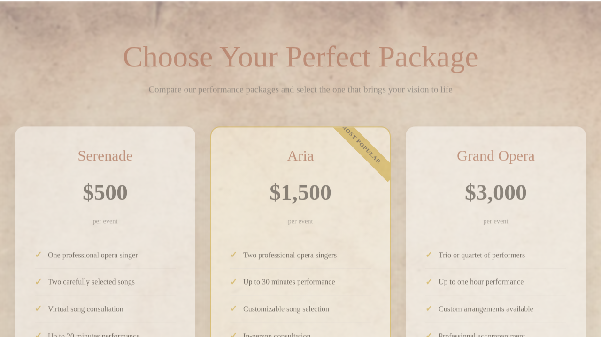

# 🎭 Aria Amore - Live Opera for Weddings & Celebrations

Transform your special day into an unforgettable performance with live opera music and entertainment. A complete, production-ready website with built-in analytics, social media integration, and comprehensive documentation.

---

## 📖 Documentation Overview

**Pick your role to find the right documentation:**

### 👤 **I'm a Site Owner**
You want to manage content, update performers, change prices, and add photos?

**What your website looks like:**


**→ [📘 Site Owner Manual](docs/SITE-OWNER-MANUAL.md)** (Start here!)
- Edit website content easily (no coding required!)
- Manage performers, packages, and pricing
- Add photos and events to your gallery
- Troubleshoot common issues
- Simple, non-technical language with examples

**Also helpful:** [💻 VS Code & Copilot Quick Start](docs/VS-CODE-COPILOT-QUICKSTART.md)
- Learn to use VS Code (text editor) and Copilot (AI assistant)
- Makes editing your content much easier
- Complete beginner guide with examples
- No programming experience needed
### 👨‍💻 **I'm a Developer**
You want to set up, deploy, or extend the codebase?

**→ [🚀 Getting Started Guide](docs/GETTING-STARTED.md)** (Start here!)
- Local development setup
- Deployment instructions
- Architecture and file structure
- Scripts and automation tools
- Testing and security validation

### ⚙️ **I'm Running Operations**
You need to maintain the server, manage backups, and monitor performance?

**→ [⚙️ Operations Guide](docs/OPERATIONS-GUIDE.md)** (Start here!)
- Deployment & maintenance checklists
- Security configuration
- Analytics setup
- Backup and health monitoring
- Social media integration

---

## 🌟 Website Features

**For Your Visitors:**
- ✅ Beautiful, responsive design (mobile and desktop)
- ✅ Live chat widget for instant inquiries
- ✅ Interactive availability calendar
- ✅ Photo and video gallery showcase
- ✅ Complete repertoire/song catalog
- ✅ Artist profiles with audio clips
- ✅ Event history and upcoming shows
- ✅ Newsletter subscription
- ✅ Social media integration (Instagram, TikTok)
- ✅ Fully accessible (WCAG 2.1 compliant)

**For Your Business:**
- ✅ Customizable service packages and pricing
- ✅ Contact form with email notifications
- ✅ Built-in analytics (Google Analytics 4)
- ✅ Social media campaign tracking
- ✅ SEO optimized for search engines
- ✅ Security headers and HTTPS enforcement
- ✅ Performance optimized (fast loading)
- ✅ Automated backups available
- ✅ Production-ready infrastructure

---

## 📸 Website Pages

Your website includes 8 main pages. Here's what each looks like:

### Homepage



### Services & Pricing


### Artists & Performers


### Events & Gallery


### Contact & More


| Page | Purpose | Edit File |
|------|---------|----------|
| **Homepage** | Hero section, featured performers, service packages | `data/homepage.json` |
| **About** | Company mission, story, and FAQ | `data/about.json` |
| **Services** | Service packages and pricing | `data/services.json` |
| **Artists** | Performer profiles with audio samples | `data/artists.json` |
| **Repertoire** | Searchable catalog of available songs | `data/repertoire.json` |
| **Events** | Upcoming and past performances | `data/events.json` |
| **Gallery** | Photos and videos from past events | `data/gallery.json` |
| **Contact** | Contact form and information | `data/contact.json` |

**[View all pages on desktop and mobile →](docs/screenshots/)**

---

## 🎯 Quick Start

### For Site Owners

**To edit your website content:**

1. Open the `data/` folder and find the JSON file you want to edit
2. Open it with a text editor (Notepad++, VS Code, or even Notepad)
3. Edit the text between the quotes
4. Save and upload the file to your server
5. Refresh your browser—changes appear instantly!

**For detailed instructions:** See the [📘 Site Owner Manual](docs/SITE-OWNER-MANUAL.md)

### For Developers

**To set up locally:**

```bash
# Clone the repository
git clone https://github.com/VidiVici98/Aria-Amore-Website-Core.git
cd Aria-Amore-Website-Core

# Run automated setup
npm run setup
# or manually: ./scripts/setup-env.sh development

# Start development server
npm start

# Open http://localhost:8000
```

**For detailed setup:** See the [🚀 Getting Started Guide](docs/GETTING-STARTED.md)

---

## 🗂️ Data File Reference

All your editable website content lives in the `data/` folder:

```
data/
├── homepage.json       → Hero title, featured performers, events
├── artists.json        → Performer profiles, bios, audio
├── services.json       → Service packages and pricing
├── about.json          → About page, mission, FAQs
├── contact.json        → Contact info and social links
├── events.json         → Upcoming and past events
├── gallery.json        → Photo gallery
└── repertoire.json     → Song catalog
```

**Quick example:**
```json
// In data/services.json
"price": "$500"  →  "price": "$550"  // Save and done!
```

---

## 💻 Project Structure

```
aria-amore-website-core/
├── public/                 # Website HTML pages
│   ├── index.html
│   ├── about.html
│   ├── services.html
│   ├── artists.html
│   ├── events.html
│   ├── gallery.html
│   ├── contact.html
│   └── repertoire.html
│
├── assets/                 # Styles, scripts, media
│   ├── css/               # Stylesheets
│   ├── js/                # JavaScript files
│   └── media/
│       ├── images/        # Upload photos here
│       └── audio/         # Upload audio here
│
├── data/                   # Editable content (JSON)
│   ├── homepage.json
│   ├── artists.json
│   ├── services.json
│   └── ... (other content files)
│
├── components/             # Shared header/footer
│   ├── header.html
│   └── footer.html
│
├── scripts/               # Automation scripts
│   ├── backup.sh
│   ├── health-check.sh
│   ├── deploy.sh
│   └── ... (more scripts)
│
└── docs/                  # Documentation
    ├── SITE-OWNER-MANUAL.md       # ⭐ For content managers
    ├── GETTING-STARTED.md         # For developers
    ├── OPERATIONS-GUIDE.md        # For operations
    ├── SECURITY.md
    ├── SOCIAL-MEDIA-GUIDE.md
    └── screenshots/               # Website screenshots
```

---

## 📋 Full Documentation Index

### Essential Reading

| Role | Document | Time |
|------|----------|------|
| **Site Owner** | [📘 Site Owner Manual](docs/SITE-OWNER-MANUAL.md) | 30 min |
| **Developer** | [🚀 Getting Started](docs/GETTING-STARTED.md) | 20 min |
| **Operations** | [⚙️ Operations Guide](docs/OPERATIONS-GUIDE.md) | 30 min |
| **Security** | [🔒 Security Policy](docs/SECURITY.md) | 15 min |

### Available Scripts

```bash
npm start              # Start development server
npm run setup          # Setup environment and permissions
npm test               # Run full test suite
npm run backup         # Create backup
npm run deploy         # Deploy to production
npm run health         # Health check
npm run security       # Security validation
npm run screenshots    # Capture website screenshots
```

---

## 🛠️ Common Tasks

### Editing Website Content

See [📘 Site Owner Manual](docs/SITE-OWNER-MANUAL.md) for detailed instructions with examples.

**Quick steps:**
1. Edit a JSON file in the `data/` folder
2. Save with UTF-8 encoding
3. Upload to your server
4. Refresh browser

### Deploying to Production

```bash
# Create deployment package
npm run deploy:siteground

# Or standard deployment
npm run deploy
```

**Full guide:** [⚙️ Operations Guide](docs/OPERATIONS-GUIDE.md#deployment--maintenance)

### Setting Up Analytics

1. Get Google Analytics ID from analytics.google.com
2. Add to `.env`: `GOOGLE_ANALYTICS_ID=G-XXXXXXXXXX`
3. Deploy changes

**Full guide:** [⚙️ Operations Guide](docs/OPERATIONS-GUIDE.md#analytics-setup)

### Monitoring Your Site

```bash
# One-time health check
./scripts/health-check.sh --once

# Continuous monitoring
./scripts/health-check.sh

# Security validation
./scripts/security-check.sh
```

---

## 📧 Email & Contact Forms

Contact form submissions are handled by `/sendmail.php` and sent to the email configured in your `.env` file.

**To configure email:**
1. Set `SITE_EMAIL` in your `.env` file
2. Configure SMTP settings (your hosting provider can help)
3. Test the contact form

**Email options:**
- SiteGround SMTP (recommended)
- Gmail SMTP
- SendGrid API
- Standard PHP mail()

---

## 🔒 Security Features

✅ **Built-in:** HTTPS enforcement, security headers, input validation  
✅ **Form Protection:** Honeypot, bot detection, spam prevention  
✅ **File Security:** Secure permissions (644/755), .env protection  
✅ **Monitoring:** Automated health checks and security scans  

Run security validation:
```bash
npm run security        # Check for issues
npm run security:fix    # Auto-fix issues
```

**Full details:** [🔒 Security Policy](docs/SECURITY.md)

---

## 📊 Performance & Analytics

### Page Speed
- Optimized images (WebP format)
- Minified CSS and JavaScript
- Browser caching enabled
- GZIP compression
- CDN ready

### Analytics
- Google Analytics 4 tracking
- Conversion tracking
- UTM campaign tracking
- Social media attribution
- Event tracking (CTAs, forms, videos)

**Setup guide:** [⚙️ Operations Guide - Analytics](docs/OPERATIONS-GUIDE.md#analytics-setup)

---

## 🧪 Testing & Quality Assurance

Run the test suite:
```bash
npm test              # Full test suite (50+ tests)
npm run test:quick    # Quick tests only
```

Tests validate:
- File structure integrity
- Data file syntax (JSON validation)
- Asset availability
- Security configuration
- Build system health

---

## 🔄 Backups & Recovery

### Automatic Backups

```bash
./scripts/backup.sh
```

Creates timestamped, compressed backups with checksums:
- `aria-amore-backup-20260303_143022.tar.gz`
- Auto-cleanup (removes backups older than 30 days)

### Manual Backups

1. Connect via FTP or file manager
2. Download the entire `data/` folder
3. Save locally or to cloud storage

---

## 🐛 Troubleshooting

### Quick Fixes

| Problem | Solution |
|---------|----------|
| Changes don't appear | Clear browser cache (Ctrl+F5 or Cmd+Shift+R) |
| JSON validation error | Check for missing commas or quotes → use jsonlint.com |
| Images not showing | Verify file path is correct (case-sensitive) |
| Forms not sending | Check .env email config; contact hosting provider |
| Site is slow | Optimize images, clear old files, check server load |

**Complete guide:** [📘 Site Owner Manual - Troubleshooting](docs/SITE-OWNER-MANUAL.md#troubleshooting)

---

## 💬 Support & Resources

### Getting Help

1. **For content editing:** See [📘 Site Owner Manual](docs/SITE-OWNER-MANUAL.md)
2. **For technical issues:** Check [⚙️ Operations Guide](docs/OPERATIONS-GUIDE.md)
3. **For security concerns:** Email security@ariaamore.com
4. **For general questions:** info@ariaamore.com

### Useful Links

- **GitHub Repository:** https://github.com/VidiVici98/Aria-Amore-Website-Core
- **JSON Validator:** https://jsonlint.com
- **Google Analytics:** https://analytics.google.com
- **Hosting Support:** Contact your provider

### Reporting Issues

- **Bugs/Features:** GitHub Issues
- **Security Issues:** security@ariaamore.com
- **Website Down:** Contact hosting provider immediately

---

## 📜 License & Legal

- **License:** See [LICENSE.txt](LICENSE.txt)
- **Security Policy:** [docs/SECURITY.md](docs/SECURITY.md)
- **Terms of Service:** Included in website (terms-of-service.html)

---

## 🎓 Learning Resources

### For Site Owners
- [📘 Site Owner Manual](docs/SITE-OWNER-MANUAL.md) — Everything you need
- [JSON Validator](https://jsonlint.com) — Check your JSON syntax

### For Developers
- [🚀 Getting Started Guide](docs/GETTING-STARTED.md)
- [⚙️ Operations Guide](docs/OPERATIONS-GUIDE.md)
- [📸 Screenshots](docs/screenshots/)
- [🔒 Security Policy](docs/SECURITY.md)

---

## 🎯 Next Steps

**Depending on your role, choose your next step:**

- **👤 I manage the website content**  
  → Read [📘 Site Owner Manual](docs/SITE-OWNER-MANUAL.md)  
  → Start editing content in the `data/` folder

- **👨‍💻 I'm setting up development**  
  → Read [🚀 Getting Started Guide](docs/GETTING-STARTED.md)  
  → Run `npm install && npm start`

- **⚙️ I'm deploying to production**  
  → Read [⚙️ Operations Guide](docs/OPERATIONS-GUIDE.md)  
  → Run `npm run deploy`

- **🔒 I'm reviewing security**  
  → Read [🔒 Security Policy](docs/SECURITY.md)  
  → Run `npm run security`

---

## 📞 Contact & Support

- **General inquiries:** info@ariaamore.com
- **Security issues:** security@ariaamore.com
- **GitHub repository:** https://github.com/VidiVici98/Aria-Amore-Website-Core
- **Issues & bug reports:** GitHub Issues

---

**Last Updated:** March 3, 2026  
**Version:** 1.0.0
