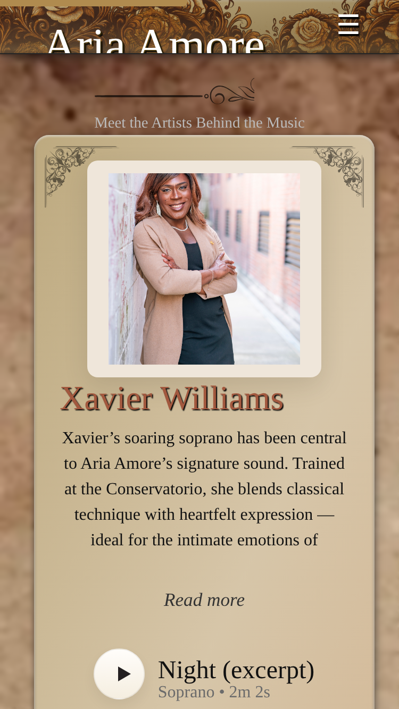
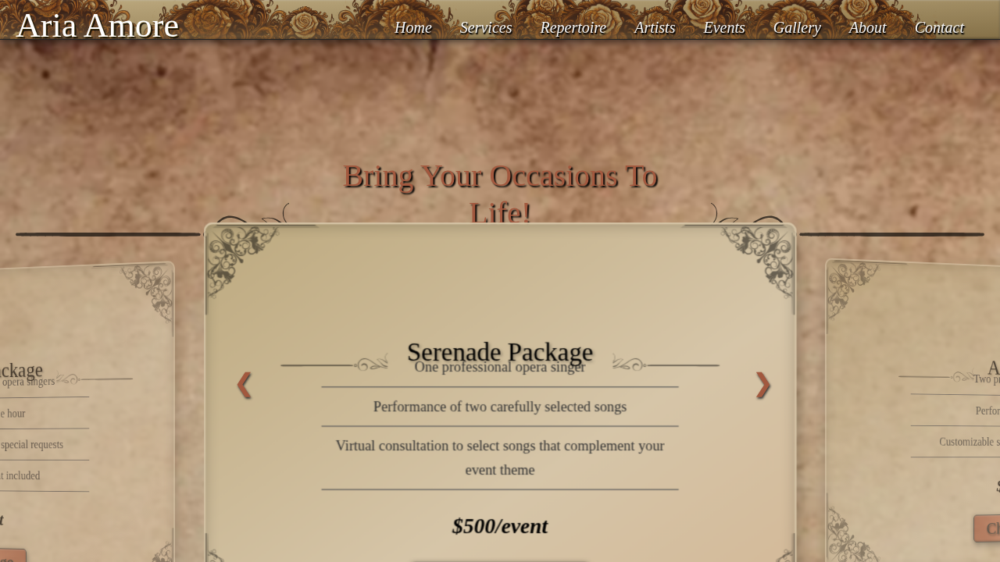
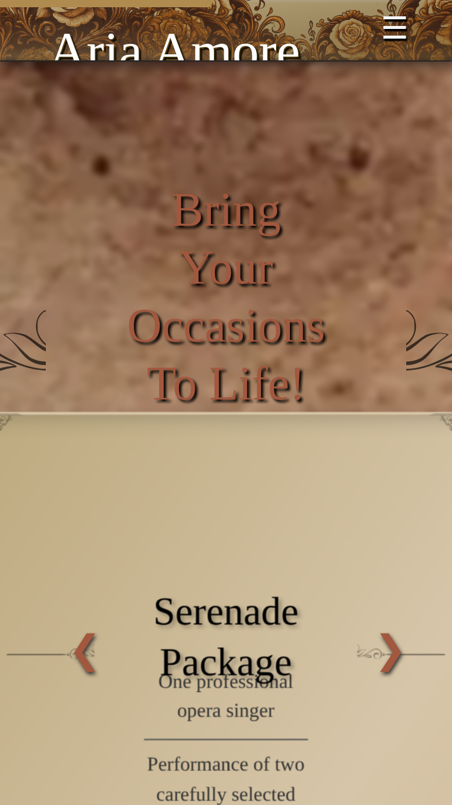
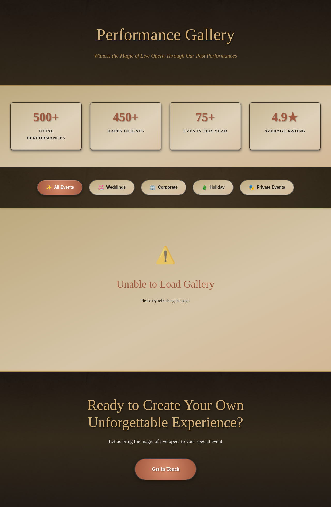
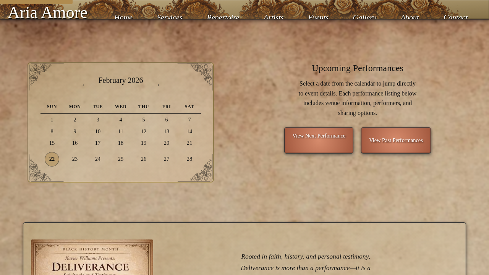
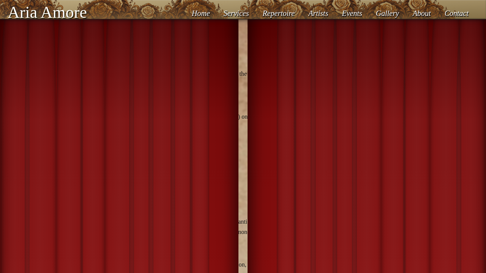
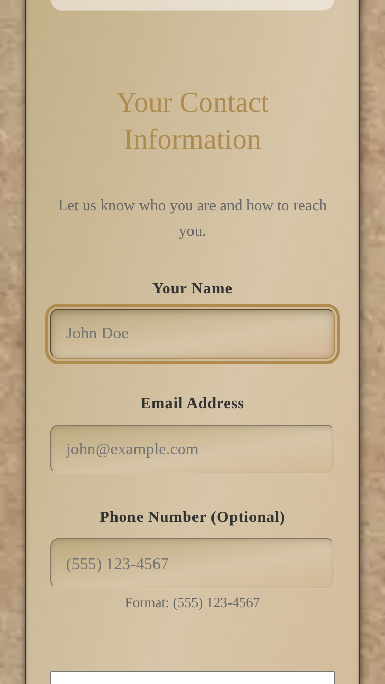

# 🎭 Aria Amore Site Owner Manual

**Welcome!** This guide will help you manage your Aria Amore website with confidence. You don't need to be a programmer—just follow the simple steps below.

---

## 🔧 Getting Started: Tools You'll Need

Before diving into content editing, you should set up **VS Code** and **Copilot** - they make editing your website much easier!

**→ First-Time Setup:** Read [💻 VS Code & Copilot Quick Start](VS-CODE-COPILOT-QUICKSTART.md) (20 minutes)

This guide covers:
- How to install VS Code (free text editor)
- How to set up Copilot (AI assistant)
- Basic skills for editing files
- Using Copilot to help with your tasks

**Why?** VS Code + Copilot let you:
✅ Edit files right on your computer  
✅ Get instant help from AI when confused  
✅ See mistakes before uploading  
✅ Save time editing content  

**After setup, come back here** to learn how to edit specific content.

---

## Table of Contents

1. [Getting Oriented](#getting-oriented)
2. [Editing Website Content](#editing-website-content)
3. [Managing Performers & Artists](#managing-performers--artists)
4. [Updating Service Packages](#updating-service-packages)
5. [Updating Gallery & Events](#updating-gallery--events)
6. [Managing Contact Information](#managing-contact-information)
7. [Monitoring Inquiries & Forms](#monitoring-inquiries--forms)
8. [Basic Maintenance](#basic-maintenance)
9. [Troubleshooting](#troubleshooting)
10. [Getting Help](#getting-help)

---

## Getting Oriented

Here's what your website looks like:

**Homepage (Desktop):**


**Homepage (Mobile):**


### How Your Website Works (The Simple Version)

Your website has two main components:

**1. The Web Pages** (HTML files)
- These are the structure of each page
- **You don't need to edit these** — they handle themselves automatically
- Examples: homepage, about page, services page, contact page

**2. The Content** (JSON files)
- These are the data files that contain all your text, images, and prices
- **You edit these when you want to change content**
- Think of them like spreadsheets, but formatted as text

Here's the flow:
```
You edit content (JSON file) 
    ↓
Save the file
    ↓
Website automatically loads your changes
    ↓
Visitors see the updated content (no technical rebuild needed)
```

### The Content Files You'll Edit

| File | What It Controls | Example Edit |
|------|------------------|--------------|
| `data/homepage.json` | Hero title, tagline, featured performers | Change "Aria Amore" to "Aria Amore Opera" |
| `data/services.json` | Service packages, pricing, features | Update package prices or add features |
| `data/artists.json` | Performer bios, photos, audio clips | Add a new performer or update bio |
| `data/about.json` | About page content, mission, FAQs | Update company mission statement |
| `data/events.json` | Upcoming and past events | Add an upcoming performance |
| `data/gallery.json` | Photo gallery images | Add new performance photos |
| `data/contact.json` | Contact page information | Update phone number or address |
| `data/repertoire.json` | Song catalog and performance options | Add a new song to the catalog |

All these files are inside the `data/` folder of your website.

---

## Editing Website Content

### The Golden Rules

Before you start editing, remember these three important rules:

✅ **DO:**
- Edit only the `data/` JSON files
- Use a plain text editor (VS Code, Notepad++, TextEdit)
- Save files as UTF-8 format
- Make a backup before making big changes
- Validate your JSON when unsure: https://jsonlint.com

❌ **DON'T:**
- Edit HTML files (the `.html` pages)
- Edit CSS or JavaScript files
- Delete commas or quote marks
- Use Microsoft Word (it adds special formatting)
- Upload files without checking them first

### Opening and Editing a File

#### Step 1: Locate the File
1. Open a file manager on your computer
2. Navigate to your website folder
3. Open the `data/` folder
4. Find the file you want to edit (e.g., `homepage.json`)

#### Step 2: Open in a Text Editor
- **Windows**: Right-click → Open with → Notepad++/VS Code
- **Mac**: Right-click → Open with → TextEdit or VS Code
- **Online Alternative**: Use https://jsoncrack.com (paste content, edit, copy back)

#### Step 3: Make Your Changes
Edit only the text between the quotes. For example:
```json
Before:
  "title": "Aria Amore"

After:
  "title": "Aria Amore - Live Opera"
```

#### Step 4: Save Your File
- Use **Ctrl+S** (Windows) or **Cmd+S** (Mac)
- Make sure the file is saved as `.json` (not `.txt`)
- Save with UTF-8 encoding

#### Step 5: Upload to Your Server
1. Connect to your website's hosting (via FTP or file manager)
2. Navigate to the `data/` folder
3. Upload/replace the edited file
4. Refresh your browser to see changes

---

## Managing Performers & Artists

Your artists/performers are managed in `data/artists.json`. This file controls the Artists page and who appears on the homepage.

Here's what it looks like on your website:

**Artists Page (Desktop):**


**Artists Page (Mobile):**


### File Structure Example

```json
[
  {
    "id": "latoya",
    "name": "Latoya",
    "portrait": "/assets/media/images/latoya.webp",
    "bio": "An internationally celebrated soprano with 15+ years of experience.",
    "tracks": [
      {
        "id": "track1",
        "title": "Ave Maria",
        "sub": "Schubert",
        "src": "/assets/media/audio/latoya-ave-maria.mp3"
      }
    ],
    "social": {
      "instagram": "https://instagram.com/latoya.opera",
      "youtube": "https://youtube.com/@latoyaopera"
    }
  }
]
```

### Common Edits

#### Change a Performer's Bio
```json
"bio": "Change this text to your new bio"
```

#### Add a New Audio Track
Add this inside the `tracks` array:
```json
{
  "id": "track-name",
  "title": "Song Name",
  "sub": "Composer or Opera Name",
  "src": "/assets/media/audio/filename.mp3"
}
```

#### Update Social Media Links
```json
"social": {
  "instagram": "https://instagram.com/their-handle",
  "youtube": "https://youtube.com/@their-channel",
  "facebook": "https://facebook.com/page-name"
}
```

#### Hide a Performer (Temporarily)
Add this line to any performer object:
```json
"hidden": true
```
Remove the line when you want to show them again.

#### Add a New Performer
Copy the entire performer object and paste it in the array (remember to add a comma):
```json
[
  { "id": "performer1", ... },
  { "id": "performer2", ... },  ← Add comma here
  { "id": "performer3", ... }   ← New performer
]
```

---

## Updating Service Packages

Service packages control your pricing and offerings. They're in `data/services.json`.

Here's what it looks like on your website:

**Services Page (Desktop):**


**Services Page (Mobile):**


### File Structure Example

```json
[
  {
    "id": "serenade",
    "name": "The Serenade Package",
    "price": "$500",
    "duration": "1-2 hours",
    "features": [
      "One professional opera singer",
      "Two carefully selected songs",
      "Perfect for intimate gatherings"
    ],
    "image": "/assets/media/images/serenade.jpg"
  }
]
```

### Common Edits

#### Change a Price
```json
"price": "$550"
```

#### Update Package Features
Edit the items in the `features` list:
```json
"features": [
  "New feature 1",
  "New feature 2",
  "New feature 3"
]
```

#### Add a Duration
```json
"duration": "2-3 hours"
```

#### Hide a Package
Add to any package:
```json
"hidden": true
```

#### Add a New Package
Create a new object in the array:
```json
{
  "id": "custom-package",
  "name": "Custom Package",
  "price": "Contact for Quote",
  "features": [...],
  "image": "/assets/media/images/custom.jpg"
}
```

---

## Updating Gallery & Events

### Gallery (Photos & Videos)

**Gallery Page:**


Gallery images are managed in `data/gallery.json`:

```json
[
  {
    "title": "Romantic Wedding Ceremony",
    "description": "A beautiful garden wedding performance",
    "image": "/assets/media/images/wedding-1.jpg",
    "category": "Weddings"
  }
]
```

**To add a new photo:**
1. Upload your image to `/assets/media/images/`
2. Add an entry to `gallery.json`:
```json
{
  "title": "Your Event Title",
  "description": "A brief description",
  "image": "/assets/media/images/your-image.jpg",
  "category": "Weddings"  // or "Events", "Corporate", etc.
}
```

### Events (Upcoming/Past)

**Events Page:**


Events are in `data/events.json`:

```json
[
  {
    "date": "2026-04-15",
    "title": "Spring Wedding at Gardens",
    "location": "Charleston, SC",
    "description": "A romantic ceremony with full ensemble",
    "image": "/assets/media/images/event-photo.jpg",
    "status": "upcoming"  // or "past"
  }
]
```

**To add an event:**
1. Upload event photo to `/assets/media/images/`
2. Add to `events.json`:
```json
{
  "date": "2026-05-20",
  "title": "Your Event Title",
  "location": "City, State",
  "description": "Brief description of the event",
  "image": "/assets/media/images/event.jpg",
  "status": "upcoming"
}
```

---

## Managing Contact Information

Contact details are in `data/contact.json`. This controls your Contact page.

**Contact Page (Desktop):**


**Contact Page (Mobile):**


### Example File

```json
{
  "intro": "Get in touch with us to book your performance.",
  "contactInfo": {
    "email": "info@ariaamore.com",
    "phone": "(843) 555-0123",
    "phoneDialable": "+18435550123",
    "address": "Charleston, South Carolina"
  },
  "social": {
    "instagram": "https://instagram.com/ariaamore.art",
    "tiktok": "https://tiktok.com/@ariaamore.art"
  }
}
```

### Common Edits

#### Update Email Address
```json
"email": "your-new-email@ariaamore.com"
```

#### Update Phone Number
```json
"phone": "(843) 555-1234",
"phoneDialable": "+18435551234"
```

#### Update Address
```json
"address": "Your City, State"
```

#### Update Social Links
```json
"social": {
  "instagram": "https://instagram.com/your-handle",
  "tiktok": "https://tiktok.com/@your-handle"
}
```

---

## Monitoring Inquiries & Forms

### How Forms Work

When visitors submit the contact form, their messages are sent to the email address configured in your `.env` file.

### Checking Submissions

1. **Check your email inbox** for form submissions
2. Messages come from: `noreply@yourdomain.com` or similar
3. Respond to inquiries directly from your email

### Configuring Email

Email is configured in a file called `.env` (not part of the data folder).

**If you're not receiving emails:**
1. Ask your hosting provider to verify SMTP settings
2. Check your spam/junk folder
3. Verify the email address in `.env` matches your inbox

---

## Basic Maintenance

### Daily Tasks
- Check form submissions (email inbox)
- Note any new booking inquiries

### Weekly Tasks
- Review website analytics if set up
- Check that pages look correct
- Verify images load properly

### Monthly Tasks
- Create a backup copy of your `data/` folder
- Review and update any outdated content
- Check all links work correctly

### Image & Media Management

#### Uploading New Images

1. Prepare your image (recommended: under 2MB, JPEG or PNG)
2. Connect to your server via FTP or file manager
3. Navigate to `/assets/media/images/`
4. Upload your image
5. Note the filename exactly (case-sensitive)
6. Reference it in your JSON file: `/assets/media/images/filename.jpg`

#### Image Best Practices
- Use descriptive names: `wedding-ceremony-2026.jpg` (not `image1.jpg`)
- Keep files under 2MB (faster loading)
- Use JPG for photos, PNG for graphics
- Make sure images are the correct size before uploading

#### Audio Files

Audio files go in `/assets/media/audio/`:

1. Upload your audio file (MP3 format recommended)
2. Reference in `artists.json`:
```json
{
  "id": "track-id",
  "title": "Song Name",
  "src": "/assets/media/audio/filename.mp3"
}
```

---

## Troubleshooting

### Content Changes Don't Appear

**Problem**: You edited a JSON file and uploaded it, but the website still shows the old content.

**Solutions** (try in order):
1. **Clear your browser cache**: Press `Ctrl+Shift+Del` (Windows) or `Cmd+Shift+Del` (Mac)
2. **Hard refresh**: Press `Ctrl+F5` (Windows) or `Cmd+Shift+R` (Mac)
3. **Wait a moment**: Sometimes it takes 30 seconds to update
4. **Check the file**: Verify you edited the correct JSON file
5. **Use a different browser**: Try Chrome, Firefox, or Safari to rule out cache issues

### JSON Validation Error

**Problem**: Your text editor or JSON validator says your file has an error.

**Solution**: Look for these common mistakes:
- Missing commas between items: `}, {` should have a comma
- Extra commas at the end: `[... }]` should not have a comma before `]`
- Mismatched quotes: `"title": "Song Name"` (use double quotes only)
- Missing quote at end of string: `"title": "Song Name` (should have closing `"`)

**Test it**: Use https://jsonlint.com to find the exact error location.

### Images Not Showing

**Problem**: Text shows but images are missing.

**Solutions**:
1. **Check the file path**: Make sure the path exactly matches the filename (case-sensitive)
   - ✅ Correct: `/assets/media/images/my-photo.jpg`
   - ❌ Wrong: `/assets/media/images/My-Photo.jpg` (capital M)
2. **Verify the file exists**: Connect via FTP and check the `/assets/media/images/` folder
3. **Check file format**: JPEG and PNG work; other formats may not

### Website Looks Broken

**Problem**: Layout is messed up, text is overlapping, spacing looks wrong.

**Solutions**:
1. **You didn't edit CSS or HTML, right?** Only edit JSON files in `/data/`
2. **Hard refresh your browser** (Ctrl+F5 or Cmd+Shift+R)
3. **Try a different browser** to rule out local issues
4. **Contact your developer** if something is structurally broken

### Contact Form Not Sending

**Problem**: Visitors submit the form but you don't receive an email.

**Solutions**:
1. **Check spam folder** — emails sometimes go there
2. **Verify email address** — is the email configured correctly in `.env`?
3. **Contact your hosting provider** — ask them to check SMTP settings
4. **Check server logs** — your developer can help with this

### Slow Website

**Problem**: Pages take a long time to load.

**Solutions**:
1. **Optimize images**: Large images slow down loading
   - Resize images before uploading
   - Use JPG format (smaller than PNG for photos)
   - Keep file size under 2MB per image
2. **Clear old files**: Delete unused images from the server
3. **Check your internet**: Try on a different network
4. **Contact your host**: Ask about server performance

---

## Getting Help

### Before You Contact Support

1. **Try troubleshooting** — see the section above
2. **Validate your JSON** — use https://jsonlint.com
3. **Take a screenshot** — of the issue you're experiencing
4. **Note what you changed** — tell us exactly what you edited

### Who to Contact

- **Content/Editing Questions**: Contact your developer
- **Form Issues**: Ask your hosting provider to check email settings
- **Website Appears Down**: Contact your hosting provider
- **Security/Hacking Concerns**: Contact your hosting provider immediately
- **Feature Requests**: Contact your developer

### Useful Information to Have Ready

When asking for help, provide:
- What you were trying to do
- What happened instead
- A screenshot or description
- Any error messages you saw
- The JSON file you were editing (if applicable)

---

## Quick Reference: File Locations

```
data/
├── homepage.json          ← Homepage hero, performers, events
├── artists.json           ← Performer bios, photos, audio
├── services.json          ← Service packages and pricing
├── about.json             ← About page content and FAQs
├── contact.json           ← Contact info and social links
├── events.json            ← Upcoming and past events
├── gallery.json           ← Photo gallery
└── repertoire.json        ← Song catalog

assets/media/
├── images/                ← Upload photos and graphics here
└── audio/                 ← Upload audio files here
```

---

## Pro Tips

### Pro Tip #1: Hide Content Temporarily
Don't want to delete something but need it hidden? Add `"hidden": true` to any item:
```json
{
  "id": "artist-name",
  "name": "Artist Name",
  "hidden": true
}
```
The website will skip it automatically. No deletion, no data loss.

### Pro Tip #2: Always Make Backups
Before doing major edits:
1. Copy your `data/` folder to your computer
2. Keep it safe (e.g., Desktop or cloud storage)
3. If something goes wrong, you can restore from backup

### Pro Tip #3: Test Changes on Your Computer First
If you have a developer, ask them to set up a local test environment:
1. You edit files on your computer
2. View changes locally before uploading
3. Only upload when you're happy with changes

### Pro Tip #4: Document Your Changes
Keep a simple log of what you changed:
```
March 3, 2026 - Updated artist bios
March 1, 2026 - Added new spring package
February 28 - Changed contact email
```
This helps if you need to undo a change later.

### Pro Tip #5: Use Version Control with Git
If you're comfortable with it, use Git to track changes:
```bash
git add data/artists.json
git commit -m "Updated artist bios"
git push origin main
```
This creates a complete history of all your edits.

---

## Still Have Questions?

This manual covers 95% of what you'll need. For more advanced topics like:
- Setting up analytics
- Social media integration
- Security configuration
- Server maintenance

See the other documentation files in the `docs/` folder, or contact your developer for help.

**You've got this!** 🎭

---

*Last Updated: March 3, 2026*
