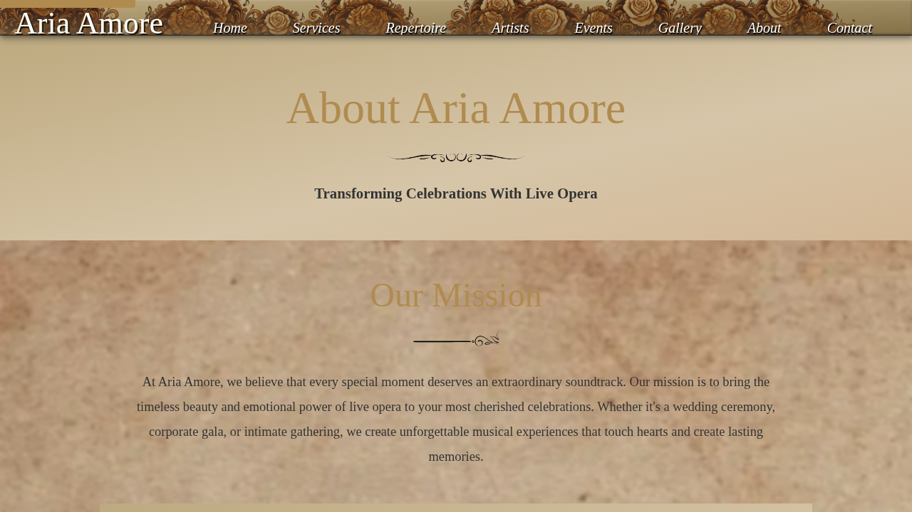
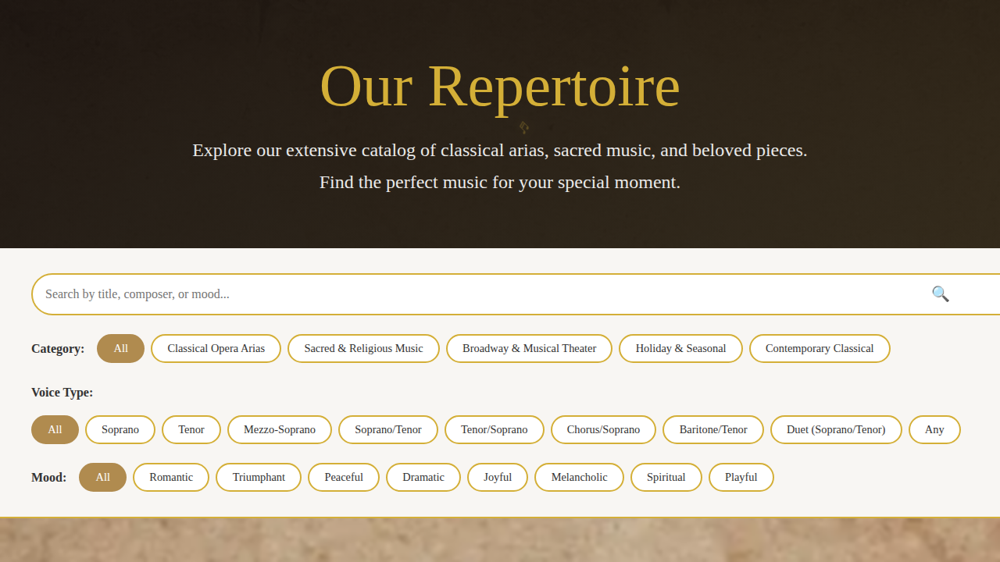
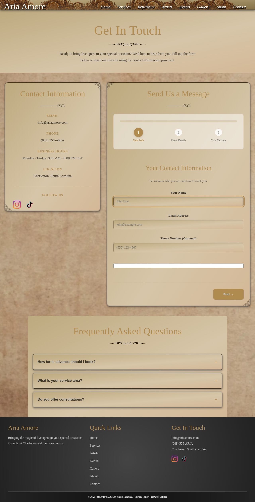
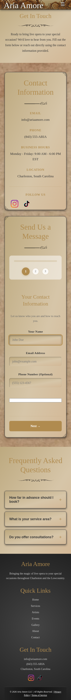
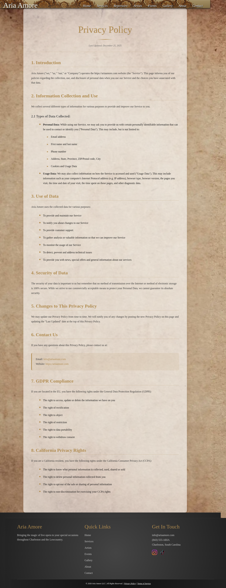
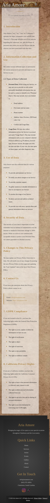
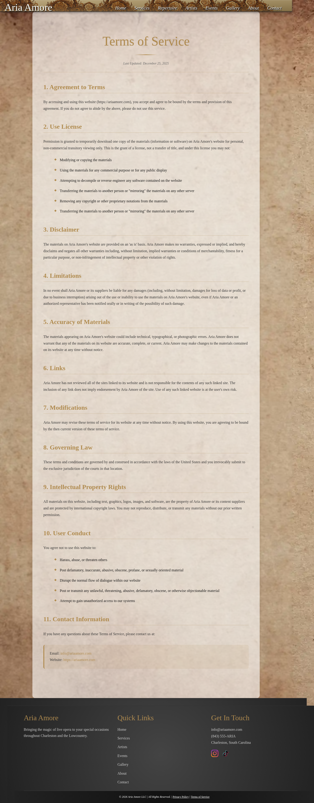
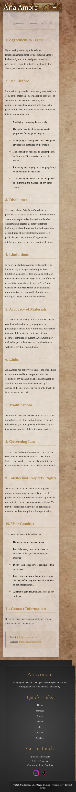
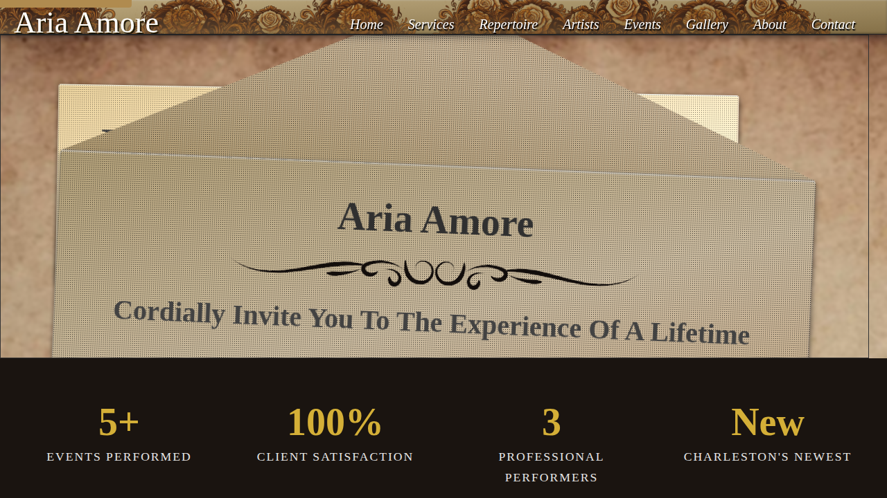
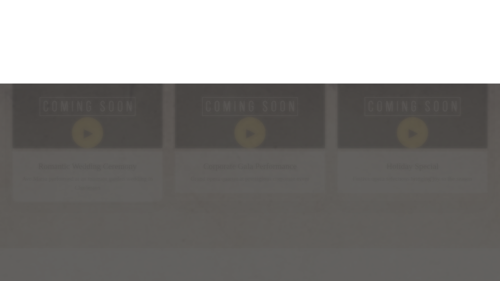

# 🎭 Aria Amore - Visual Feature Guide

This guide showcases all website features with accompanying screenshots. See what your website looks like and understand how each section works.

---

## Table of Contents

1. [Homepage](#homepage)
2. [About Page](#about-page)
3. [Services Page](#services-page)
4. [Artists Page](#artists-page)
5. [Repertoire Page](#repertoire-page)
6. [Events Page](#events-page)
7. [Gallery Page](#gallery-page)
8. [Contact Page](#contact-page)
9. [Legal Pages](#legal-pages)
10. [Features Overview](#features-overview)

---

## Homepage

Your homepage is the first impression visitors get. It includes:

**Desktop View:**

**Service Packages on Homepage:**

**Mobile View:**

### Hero Section
- **Main heading** with elegant styling
- **Tagline** explaining your value proposition
- **Call-to-action buttons** to encourage bookings
- **Navigation menu** for easy page access

**Edit in:** `data/homepage.json` → `hero` section

### Featured Performers Carousel
Shows your top performers with clickable cards to learn more. Users can scroll through and see:
- Performer photo
- Name
- Link to full artist profile

**Edit in:** `data/homepage.json` → `performers` section

### Service Packages Section
Displays your 3 service tiers with:
- Package name
- Price
- Feature list
- Call-to-action button

**Edit in:** `data/services.json`

**Visitor benefit:** Clear comparison helps visitors choose the right package for their event.

### Upcoming Events or Promotions
Dynamic announcements about upcoming performances or special offers.

**Edit in:** `data/homepage.json` → `events` section

### Contact & Newsletter
- Email signup to capture leads
- Social media links (Instagram, TikTok)
- Quick contact options

---

## About Page

Tells your company story and builds trust.

### What's Included
- **Company mission statement** - Why you exist
- **Company story** - Your background and journey
- **Team bios** - Individual performer profiles
- **FAQ section** - Answer common questions
- **Trust indicators** - Years of experience, happy clients, etc.

**Edit in:** `data/about.json`

### Why It Matters
Visitors want to know who you are before booking. This page builds confidence in your professionalism.

---

## Services Page

Your main booking/sales page that converts visitors to customers.

**Desktop View:**

**Mobile View:**

### What's Included
- **Service package comparison** - Show all three tiers side-by-side
- **Detailed descriptions** - What's included in each package
- **Pricing** - Clear costs for each option
- **Booking form** - Easy-to-use form to request bookings

### Package Tiers (Typical)
1. **Serenade** - Single performer, 1-2 songs ($500-800)
2. **Aria** - 2-3 performers, full program ($1500-2000)
3. **Grand Opera** - Full ensemble, custom program ($2500+)

**Edit in:** `data/services.json`

### Why It Matters
**This page generates revenue.** Clear pricing and simple booking process = more conversions.

---

## Artists Page

Showcases your performers and builds confidence in your team.

**Desktop View:**

**Mobile View:**

### What's Included
- **Performer cards** - Photo, name, bio
- **Audio samples** - Hear them sing before booking
- **Social links** - Instagram, YouTube, Facebook
- **Experience level** - Show their credentials

### Audio Playback
Visitors can click "Play" on any song sample to hear your performers live. This is crucial for selling your services!

**Edit in:** `data/artists.json`

### Why It Matters
**People book YOU.** Great artist profiles with audio samples help visitors imagine your performance at their event.

---

## Repertoire Page

Complete catalog of songs your performers can sing.

### What's Included
- **Searchable song list** - Visitor can search for favorites
- **Voice type filters** - Soprano, Alto, Tenor, Bass
- **Composer information** - Classical opera knowledge
- **Performance options** - Solo, duet, ensemble

### User Experience
Visitors can search for "Ave Maria" or "O Mio Babbino Caro" and see exactly what voice types offer it.

**Edit in:** `data/repertoire.json`

### Why It Matters
If your visitor wants a specific song, they need to know you offer it. This page answers that question quickly.

---

## Events Page

Showcases past performances and upcoming shows.

### What's Included
- **Event date and location** - When and where you performed
- **Event description** - Type of event and highlights
- **Event photo** - Visual proof of your work
- **Status** - Mark as "Upcoming" or "Past"

**Edit in:** `data/events.json`

### Why It Matters
**Social proof!** Past events with photos prove you deliver quality performances. Upcoming events build excitement.

---

## Gallery Page

Photo and video showcase of your performances.

### What's Included
- **High-quality photos** - Professional event photography
- **Event highlights** - Best moments from past performances
- **Category filters** - Wedding, Corporate, Holiday, etc.
- **Responsive grid** - Looks great on all devices

**Edit in:** `data/gallery.json`

### Why It Matters
**A picture is worth 1000 words.** Beautiful photos help visitors emotionally connect with your services.

**Pro Tip:** Upload high-quality, professional photos. Phone photos are okay, professional photographer photos are better.

---

## Contact Page

How visitors reach you.

**Desktop View:**

**Mobile View:**

### What's Included
- **Contact form** - Visitors submit booking inquiries
- **Phone number** - For direct calls
- **Email address** - For email inquiries
- **Mailing address** - Physical location
- **Social media links** - Follow your accounts
- **Live chat widget** - Instant message support

**Edit in:** `data/contact.json`

### Form Features
- Real-time validation - Tells users if they enter incorrect info
- Spam protection - Honeypot field, bot detection
- Email notification - You get notified of submissions
- Thank you message - Visitor gets confirmation

### Why It Matters
**This is where conversions happen.** Make it easy to submit booking inquiries.

---

## Legal Pages

Required pages for your business.

**Privacy Policy:**

**Terms of Service:**

### Privacy Policy
- How you collect visitor data
- How you use their information
- Privacy commitments
- Compliance with laws

### Terms of Service
- Your terms for bookings
- Cancellation policies
- Liability information
- Owner responsibilities

**Note:** Pre-written templates are included. Customize them for your business.

---

## Features Overview

### Global Features (On Every Page)

#### Navigation Menu
- **Desktop:** Top menu bar with all pages
- **Mobile:** Hamburger menu (three lines) that expands
- **Sticky:** Stays at top as you scroll

**Edit in:** `components/header.html`

#### Live Chat Widget
- **Floating button** on bottom right
- **Visitors click to message** you instantly
- **Professional appearance** with your branding
- **Mobile optimized** - Easy to use on phones

**Collapsed State:**

**Expanded State:**

**Mobile Chat Button:**

**Features:**
- Collapsed/expanded states
- Online/offline indicators
- Chat history
- Professional message templates

#### Footer
- **Copyright information** - Shows your business name and year
- **Contact info** - Phone, email, address
- **Quick links** - Links to main pages
- **Social media icons** - Link to your accounts
- **Newsletter signup** - Email capture

**Edit in:** `components/footer.html`

#### Mobile Responsiveness
- **Adapts to phone screens** - Text, images, buttons resize
- **Touch-friendly buttons** - Easy to tap on phones
- **Readable text** - Font size adjusts
- **Single-column layout** - No horizontal scrolling

**Tested on:** iPhone, Android, iPad, all tablet sizes

---

## Design Features

### Color Scheme
- **Gold/elegant** - Premium, upscale feeling
- **Red curtain accents** - Theatre/opera theme
- **Professional backgrounds** - Elegant textures
- **High contrast text** - Easy to read

### Typography
- **Elegant fonts** - Serif fonts for headers, sans-serif for body
- **Readable sizes** - Large enough for all ages
- **Visual hierarchy** - Important text is bigger/bolder

### Accessibility
- **Keyboard navigation** - Navigate without mouse
- **Screen reader compatible** - Works with accessibility tools
- **Color blind friendly** - Doesn't rely only on color
- **WCAG 2.1 Level AA** - Industry standard compliance

---

## Performance & SEO

### Page Speed
- **Fast loading** - Optimized images and code
- **Caching enabled** - Browsers remember your page
- **Mobile optimized** - Works great on slow connections

### Search Engine Optimization
- **Google indexed** - Shows up in search results
- **Meta descriptions** - Preview text in search results
- **Structured data** - Rich search results
- **Mobile friendly** - Appears in mobile search results

---

## Analytics & Tracking

### What Gets Tracked
- **Page visits** - How many people visit each page
- **User journey** - Where visitors go on your site
- **Form submissions** - When visitors submit booking requests
- **Click tracking** - Which buttons visitors click
- **Scroll depth** - How far down the page people scroll

### How It Helps
Shows you:
- Which pages attract visitors
- Which pages convert to bookings
- What's working vs. what's not
- Where to focus your marketing

---

## Social Media Integration

### Sharing Features
- **Share buttons** - Visitors share on Facebook, Twitter, LinkedIn, etc.
- **Open Graph tags** - Nice preview when shared on social media
- **Hashtag ready** - Pre-written social media copy
- **Campaign tracking** - See which shares drive visitors

### Social Links
- **Instagram** - Link to your profile
- **TikTok** - Link to your short videos
- **Facebook** - Link to your page
- **Other platforms** - Easy to add more

---

## Administration & Maintenance

### What You Need to Do
1. **Update content** - Edit JSON files when things change
2. **Add new photos** - Upload to gallery as you do more events
3. **Add new performers** - Update artists.json when hiring someone
4. **Monitor inquiries** - Check email for booking requests
5. **Respond to visitors** - Use live chat and email

### What's Automated
- **Updates appear instantly** - No need to rebuild
- **Backups** - Automatic daily backups
- **Security** - Automatic security updates
- **Performance** - Automatic optimization

---

## Next Steps

### To Learn More

**For content editing:**
→ Read [📘 Site Owner Manual](SITE-OWNER-MANUAL.md)

**For technical details:**
→ Read [🚀 Getting Started Guide](GETTING-STARTED.md)

**For operations & deployment:**
→ Read [⚙️ Operations Guide](OPERATIONS-GUIDE.md)

### To See Live Examples

View the actual website screenshots in `docs/screenshots/` folder:
- Desktop page screenshots (1280x720)
- Mobile page screenshots (375x667)
- Chat widget examples
- All 8 main pages documented

---

## Quick Reference

| Page | Edit File | Purpose |
|------|-----------|---------|
| Homepage | `data/homepage.json` | First impression, featured performers, packages |
| About | `data/about.json` | Company story, mission, team, FAQ |
| Services | `data/services.json` | Packages, pricing, booking form |
| Artists | `data/artists.json` | Performer profiles, audio samples |
| Repertoire | `data/repertoire.json` | Song catalog, voice types |
| Events | `data/events.json` | Past and upcoming performances |
| Gallery | `data/gallery.json` | Event photos and videos |
| Contact | `data/contact.json` | Contact form, information, social links |

---

**Last Updated:** March 3, 2026  
**Version:** 1.0.0
